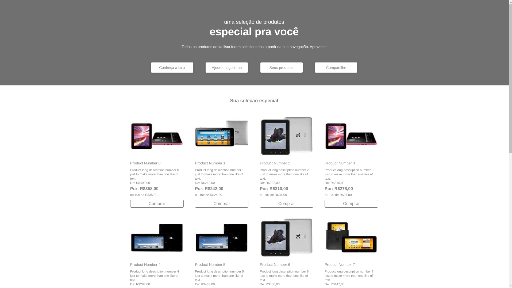
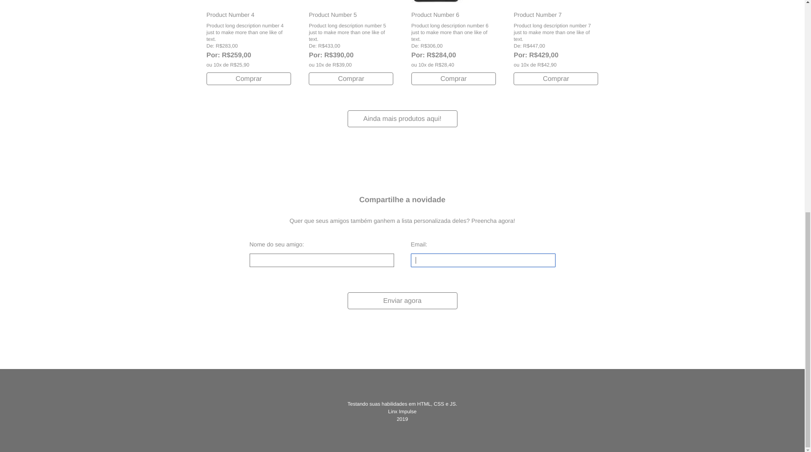

## Motivação
Esta página foi realizada para treinamento de tecnologias como HTML, CSS e JS.

## Screenshots



## Execução
Para executar a página localmente, você deve possuir o [live-server](https://www.npmjs.com/package/live-server) ou algum sistema similar.
```
$ git clone https://github.com/joaobb/frontend-developer-challenge
$ cd frontend-developer-challenge/proj/
$ live-server
```
